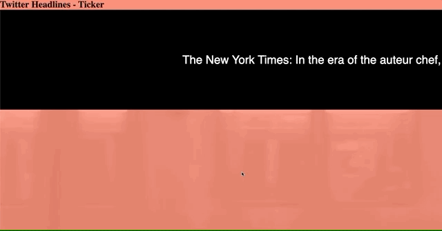

# "Exercise with Twitter API - using Promises"

A small exercise during lecture about using Express with the Twitter API and jQuery in order to create a moving headlines component.

[Exercise on Heroku](https://classicconnectfour.herokuapp.com/)

## Built With

-   Express
-   Javascript and jQuery
-   HTML and CSS
-   php to deploy to heroku

**Sven Kranz** - [SvenKranz1991](https://github.com/SvenKranz1991) | [LinkedIn](https://www.linkedin.com/in/sven-kranz-a2389318b/) | [Website](www.google.com)
